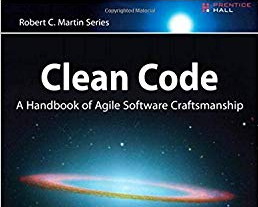
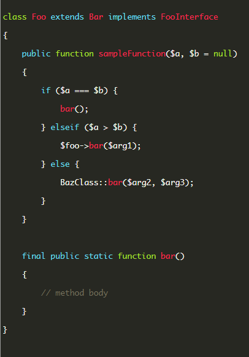

# Clean Code

> Tầm quan trọng và một số quy tắc để giúp code "clean".



1. __Nhận dạng code "clean" và tầm quan trọng.__
- Độ "clean" của code có thể nhận biết qua việc developer mất bao nhiêu thời gian để đọc hiểu được nó.
- Một đoạn code "clean" phải hiệu quả, dễ đọc, đơn giản, rõ ràng, không bị trùng lặp, không chứa các thao tác dư thừa, có khả năng tái sử dụng khi cần thiết.
- Clean Code có vai trò cực kì quan trọng đối với dự án, giúp dự án phát triển nhanh hơn, bảo trì dễ dàng hơn, tránh lãng phí thời gian và công sức của team.

2. __Một số điểm chính trong sách Clean Code- Robert C.Martin
- Meaningful Names__
	- Các class, biến, phương thức phải được đặt tên một cách có nghĩa, dễ hiểu, thể hiện chính xác vai trò và mục đích sử dụng của nó.
		Bad:
		```
			$ymdstr = $moment->format('y-m-d');
		```
		Good:
		```
			$currentDate = $moment->format('y-m-d'); 
		```
	- Tên dễ đọc, dễ tìm kiếm vì chúng ta không chỉ đọc code mà còn viết code sau đó.
	- Hạn chế viết tắt và tránh đặt tên gây hiểu lầm gây khó khăn cho người đọc code
	- Tên thể hiện được bối cảnh và vấn đề cần được giải quyết.
	- Sử dụng hằng để tăng độ clean của code 
		Bad:
		```
			if (Course->type==1) then continue; ( What is "1" ?)
		```
		Good:
		```
			Const PUBLIC =1,PRIVATE=2;
			if (Course->type== PUBLIC) then continue; 
		``` 
- __Functions__
	- Functions truyền tải chính xác thông điệp về vai trò và mục đích của nó
	- Mỗi phương thức chỉ nên thực hiện 1 công việc duy nhất.
	- Một phương thức không nên quá dài.
	- Số lượng parameter lý tưởng nhất là zero, sau đó và 1 và 2. Nếu nhiều hơn 3, nên xem xét gộp các parameter đó vào 1 object.
	- Tránh sử dụng if-else quá sâu và nên return sớm.
		Bad:
		```
			function fibonacci(int $n)
			{
			    if ($n < 50) {
			        if ($n !== 0) {
			            if ($n !== 1) {
			                return fibonacci($n - 1) + fibonacci($n - 2);
			            } else {
			                return 1;
			            }
			        } else {
			            return 0;
			        }
			    } else {
			        return 'Not supported';
			    }
			}
		```
		Good:
		```
			function fibonacci(int $n): int
			{
			    if ($n === 0 || $n === 1) {
			        return $n;
			    }
				if ($n >= 50) {
			        throw new \Exception('Not supported');
			    }
			    return fibonacci($n - 1) + fibonacci($n - 2);
			} 
		```
	- Các phương thức nên trả về một cái gì đó ( kết quả, giá trị, ...)
- __Comments__
	- Hãy viết code một cách clean, để chính nó giải thích rõ ràng về những gì mà nó làm. Thay vì viết một đoạn code tồi và sử dụng comments để chữa cháy.
	- Comments chỉ nên được sử dụng để giải thích, thể hiện những gì mà code không thể hiện rõ ràng được.

3. __PHP Standards Recommendations__
__PSR-1 Basic Coding Standard__
	- Tên lớp PHẢI có dạng NameClass (not nameclass, Nameclass, namClass …)
	- Tên phương thức của lớp PHẢI ở dạng doSomething.
	- Hằng PHẢI viết hoa, phân tách với dấu _ ( IS_PUBLIC)
__PSR-2 Coding Style Guide__	
	- Code sử dụng 4 kí tự space để lùi khối
	- Mỗi dòng code PHẢI dưới 120 kí tự, NÊN dưới 80 kí tự.
	- Ký tự "{" và "}" cho Class và Function phải ở dòng tiếp theo
	- Ký tự "{" cho cấu trúc điều khiển phải ở trên cùng 1 dòng, "}" thì ở dòng tiếp theo.
	- Hằng số true, false, null PHẢI viết với chữ thường.

	

Updating...	


