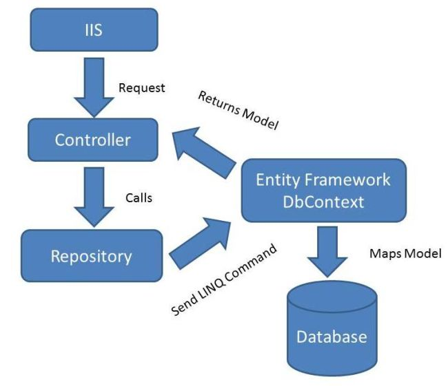

# REPOSITORY PATTERN

  

1. __Giới thiệu Repository Patern__      
Thay vì mô hình MVC truyền thống, nơi Controller và Model làm  việc trực tiếp với nhau để thực hiện các thao tác với dữ liệu, Repository Patern sử dụng một lớp trung gian ở giữa Controller và Model, gọi là Repository. Có thể hiểu, Repository là nơi chứa các logic truy cập dữ liệu, Clients có thể lấy các dữ liệu cần thiết mà không cần biết các hoạt động chi tiết bên trong diễn ra như thế nào.  
Repository Patern được sử dụng để giảm sự ràng buộc giữa Controller và Model. Khi Model thay đổi, việc cần làm chỉ là cập nhật lại ở Reposity, thay vì dò tìm tất cả các thay đổi liên quan ở Controller và sửa chúng. Điều này sẽ được minh họa rõ ràng hơn khi áp dụng Repository Patern vào một Project Laravel dưới đây.  

2. __Ví dụ về một vấn đề thường gặp trong Laravel__      
Hãy tưởng tượng ta cần in ra danh sách các khóa học. Xử lý trong Controller sẽ như sau:

    ```
    use App\Models\Course;
    class CourseController extends Controller
	{
    	public function index()
    	{
        	$courses = Course::all();
        	return $courses;
    	}
    }	
    ```	

Ở đây, CourseController sử dụng CourseModel để lấy danh sách tất cả các course. Sau đó, khách hàng thay đổi yêu cầu, chỉ hiển thị danh sách các khóa học có status là public trở đi mà thôi. Trong trường hợp này, việc ta có thể làm là thay `Course::all()` bằng `Course::where('status','public')`. Điều này vẫn có thể xem là chấp nhận được khi quy mô của Project không quá lớn. Ngược lại, nếu Project có vài Controller, mỗi Controller lại có vài chục nơi gọi Model `Course::all()`, việc bảo trì code theo yêu cầu ở đây sẽ rất mất thời gian và tiềm ẩn nhiều rủi ro phát sinh. Đây chính là lúc Repository Pattern nên được sử dụng.

3. __Áp dụng Repository Pattern để giải quyết vấn đề.__    
Thêm vào folder Repositories trong *app*. Tạo một CourseRepository như sau: 

```
	use App\Models\Product;
	class CourseRepository
	{
    	public function getCourse()
    	{
        	return Course::all();
    	}
    }
```

Từ đây, CourseRepository sẽ đảm nhận vai trò tương tác với Model để lấy dữ liệu, ở đây là danh sách các khóa học. Controller sẽ thông qua Repository để lấy thứ mình cần như sau:

```
    use App\Repositories\CourseRepository;
    class CourseController extends Controller
	{
		public function __construct(CourseRepository $courseRepository)
    	{
        	$this->courseRepository = $ourseRepository;
    	}
    	public function index()
    	{
        	$courses = $this->coursetRepository->getCourse();
        	return $courses;
    	}
    }	
```

Có thể dễ dàng nhận thấy sự thay đổi ở Controller: 
    - Thực hiện Dependency Injection để khởi tạo 1 instance của CourseRepository.
    - Gọi đến phương thức getCourse() của instance đó để lấy thứ mình cần.

Quay lại vấn đề ta đề cập lúc trước, khi có yêu cầu thay đổi về việc chỉ hiển thị những khóa học có tình trạng public mà thôi. Việc cần làm của ta bây giờ là vào CourseRepository để chỉnh sửa phương thức `getCourse()` cho phù hợp, __không cần động chạm gì đến các Controller cả__ !

4. __Kết luận__  
Trên đây là ví dụ về cách mà Repository Pattern được ứng dụng để giải quyết một vấn đề trong một project Laravel. Trong thực tế, Controller không sử dụng trực tiếp Repository mà thông qua Interface của nó. Để hiểu thêm về vấn đề này, bạn có thể tham khảo thêm tại [*đây*](https://github.com/HuynhTanDuy/Duy-Software-Engineer/tree/master/Laravel%20Architecture%20concepts/Service%20Container).
Tác dụng dễ thấy nhất của nó là việc giảm sự ràng buộc giữa Controller và Model. Dẫn đến khi có sự thay đổi bắt buộc ở Model, sẽ không kéo theo việc phải chỉnh sửa code ở Controller. Qua đó, nâng cao tính maintain và scale của project.


	

