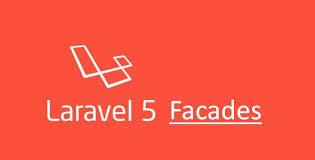

# Facades



1. __Khái niệm__  
  
  Facades cung cấp một 'giao diện' của các class được đăng ký ở Service Container, cho phép bạn truy cập vào các hàm bên trong các class này thông qua các hàm *static*. Tất cả các Facades của Laravel được định nghĩa trong *Illuminate\Support\Facades* , ta có thể dễ dàng truy cập vào facades như sau:  
  ```
  use Illuminate\Support\Facades\Cache;

  Route::get('/cache', function () {
    return Cache::get('key');
  });
  ``` 
2. __Cách Facades hoạt động__  
  Tất cả các Facades nằm ở *Illuminate\Support\Facades*. Lấy ví dụ về Facades rất hay được sử dụng là *Auth* :
  ```
  namespace Illuminate\Support\Facades;

  class Auth extends Facade
  {
    protected static function getFacadeAccessor()
    {
        return 'auth';
    }
  }
  ```
  Chỉ có một function *getFacadeAccessor()* khá vô nghĩa. Tuy nhiên, class *Auth* đang kế thừa 1 abstract class *Facades*  Để hiểu được ngọn ngành, ta cần truy cập vào abstract class này:

  ```
  protected static $app; 

  // Ta bắt buộc phải khai báo override hàm getFacadeAccessor() ở class kế thừa (bằng không sẽ có error). 
  protected static function getFacadeAccessor()
  {
      throw new RuntimeException('Facade does not implement getFacadeAccessor method.');
  }

  protected static function resolveFacadeInstance($name)
    {
        if (is_object($name)) {
            return $name;
        }

        if (isset(static::$resolvedInstance[$name])) {
            return static::$resolvedInstance[$name];
        }

        return static::$resolvedInstance[$name] = static::$app[$name];
    }

  public static function __callStatic($method, $args)
    {
        $instance = static::getFacadeRoot();

        if (! $instance) {
            throw new RuntimeException('A facade root has not been set.');
        }

        switch (count($args)) {
            case 0:
                return $instance->$method();
            case 1:
                return $instance->$method($args[0]);
            case 2:
                return $instance->$method($args[0], $args[1]);
            case 3:
                return $instance->$method($args[0], $args[1], $args[2]);
            case 4:
                return $instance->$method($args[0], $args[1], $args[2], $args[3]);
            default:
                return call_user_func_array([$instance, $method], $args);
        }
    }  
  ```  
  Đọc kỹ nội dung abstract class Facade bạn sẽ thấy được rằng nội dung mà method getFacadeAccessor() trả về sẽ được sử dụng để tạo ra Facade Instance, mà instance này được resolve ra từ Application Instance $app, hay nói cách khác chính là Service Container.  
  Như vậy thì ta có thể thấy các cách gọi sau sẽ là tương đương: 
  ```
  Auth::check();

  // Bản chất của lời gọi hàm static qua Facade có thể được tóm tắt lại thành
  $auth = app('auth');
  $auth->check();
  ```

3. __Kết luận__
  Facades thuận tiện, dễ sử dụng. Tuy nhiên nó vẫn gây tranh cãi khá nhiều vì tính Anti-design của nó. Một developer mới nhập môn có thể dễ dàng sử dụng Auth::user() mà không cần phải khởi tạo, resolve các instance từ Service Container, nhưng họ sẽ không hiểu được bản chất của hàm, một đống 'magic' được xử lý ngầm bên dưới. Khi gặp vấn đề, sẽ khó mà debug để tìm ra vấn đề được. 

# References  
- https://laravel.com/docs/6.x/facades
- https://viblo.asia/p/laravel-beauty-tim-hieu-ve-facade-znVGLYLbvZOe

  

