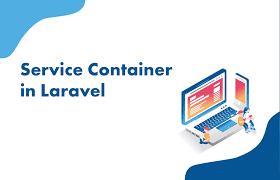

# Service Container



1. __Service Container là gì ?__    
	Service Container được mệnh danh là "trái tim" của Laravel. Một cách ngắn ngọn, đây là nơi quản lý class dependency và thực hiện dependency injection. 
		- Nếu Class A hoạt động phụ thuộc vào một số class khác, ta sẽ khởi tạo instance của các class đó ở bên trong class A. Những instance đó được gọi là dependency. 
		- Quá trình inject các instance đó vào class A thông qua Constructor hoặc Setter chính là Dependency injection. 

2. __Service Container hoạt động như thế nào ?__ 
	Laravel sử dụng khái niệm "bind" để đăng ký 1 class hay 1 interface với Container, và "resolve" để lấy ra instace từ container. Ví du:

	```
	class Computer
	{
       public $monitor;
       public $keyboard;
       public function __construct(Monitor $monitor, Keyboard $keyboard)
       {
          $this->monitor = $monitor;
          $this->keyboard = $keyboard;
       }
    }
    app()->bind('computer', 'Computer');
    $computer = app('computer');
    // Hoặc
    $computer = app('Computer');
    ```

    __Quy trình thực hiện:__   
    	- Khởi tạo class Computer với các dependency của nó.  
    	- *app()->bind('computer', 'Computer');* => đăng ký instance của class Computer bằng cái tên 'computer'.  
    	- *$computer = app('computer');* . Đây là lúc ta resolve instance của class Computer đã đăng ký với Service Container trước đó.  
    	- *$computer = app('Computer');*. Một minh chứng cho thấy sự mạnh mẽ của Service Container. Trong trường hợp này, Container sẽ kiểm tra xem đã có cái gì được đăng ký với tên 'Computer' hay chưa. Nếu chưa, nó sẽ xác định 'Computer' là tên class và tiến hành resolve instance từ class Computer.    
    Dễ dàng nhận thấy, ta không cần phải truyền bất cứ callback nào vào hàm bind cả. Thậm chí ta còn có thể gọi thẳng app('Computer') để khởi tạo ra một instance của Computer mà không cần bind gì hết, không cần khởi tạo dependency, không cần inject cái gì cả ! Service Container thực sự là 1 công cụ mạnh mẽ giúp ta thực hiện dependency injection 1 cách hiệu quả, nhanh chóng, chính xác.

3. __Các cách thức Binding__  
	- __Singleton binding__: Như tên gọi của nó thì instance sẽ chỉ được resolve một lần, những lần gọi tiếp theo sẽ không tạo ra instance mới mà chỉ trả về instance đã được resolve từ trước. 
	```
	app()->singleton('now', function() {return time();});
    app('now') === app('now'); // true
	```

	- __Instance binding__: Cũng gần giống với Singleton Binding. Bạn có một instance và bạn bind nó vào Service Container. Mỗi lần lấy ra bạn sẽ nhận lại được instance đó.
	```
	$now = time();
    app()->instance('now', $now);
    $now === app('now'); // true
    ```

    - __Interface binding__:  Vâng nếu bạn bind một Interface với một Implementation của nó thì bạn sẽ có thể type-hint được Interface đó. Hãy cùng xem ví dụ dưới đây
    ```
    class MailerImplementation implements MailerInterface {}
    app()->bind('MailerInterface', 'MailerImplementation');
    public function __construct(MailerInterface $mailer)
    {
    $this->mailer = $mailer;
    }
    ```
    - Sau khi thực hiện Interface binding, trong constructor của một class nào đó ta có thể type-hint theo interface. Đây là một ứng dụng được phổ biến rộng rãi trong các project Laravel. Bằng cách này, ta follow theo nguyên tắc  __"program to an interface, not an implementation"!__, thực hiện dependency injection thông qua các interface. Điều này sẽ giúp ta giảm sự ràng buộc giữa các class so với việc inject bằng implemention. 
    - Hãy tưởng tượng, bạn inject implemention "Mailgun" vào class "UserController" để thực hiện việc gửi mail, sau này nếu có yêu cầu thay đổi service gửi mail sang AWS Mailer, bạn sẽ phải vào class "UserController" để thay đổi cho phù hợp với implemention mới. Trong khi đó, nếu áp dụng Interface binding, đăng ký 1 interface 'Mailer' và thực hiện dependency inject thông qua nó, khi có thay đổi bạn chỉ cần thay đổi implemention của interface 'Mailer' mà thôi. __KHÔNG CẦN CHỈNH SỬA__ gì ở "UserController" cả. 

# References 
- https://laravel.com/docs/6.x/container  
- https://viblo.asia/p/laravel-beauty-tim-hieu-ve-service-container-3KbvZ1wLGmWB  


