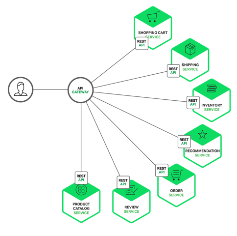
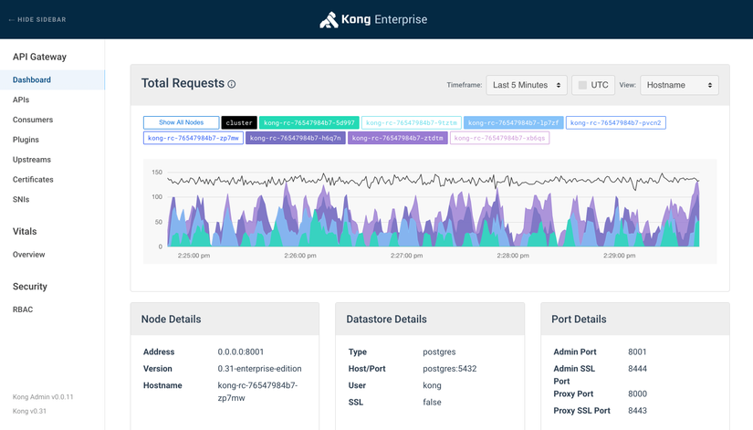

# Microservices

1.	__Microservices là gì ?__  
   Microservices là một kiến trúc phần mềm, trong đó phần mềm được chia nhỏ thành các services có đặc điểm
	- Dễ bảo trì và test.
	- Không bị ràng buộc chặt với nhau.
	- Mỗi services tập trung vào 1 nhiệm vụ duy nhất.
	- Triển khai một cách độc lập.
	- Có thể được chịu trách nhiệm triển khai bởi các team khác nhau, với ngôn ngữ, database và server khác nhau.
	- Giao tiếp với nhau để thực hiện vai trò của phần mềm.

2. __Ưu và nhược điểm__ 
   - Ưu điểm: 
	   - Dễ nâng cấp và mở rộng.
	   - Khi một service bị lỗi, hệ thống vẫn hoạt động bình thường. Với monolith, một module lỗi có thể kéo theo sự sụp đổ của toàn bộ hệ thống
	   - Linh hoạt trong việc sử dụng ngôn ngữ lập trình, database, công nghệ mới. Ví dụ như service xử lý ảnh có thể dùng C++, service tổng hợp data có thể viết bằng python => tăng hiệu suất phần mềm.
	   - Các công việc Devops sẽ trở nên dễ dàng hơn.
	   - Có thể chia team thành các team nhỏ hơn để chịu trách nhiệm cho các service.
   - Nhược điểm:
	   - Các Module giao tiếp qua mạng nên tốc độ sẽ chậm hơn so với Monolith.
	   - Không đảm bảo tính nhất quán về dữ liệu.
	   - Yêu cầu sẽ cao hơn đối với đội ngũ phát triển vì độ phức tạp của Microservices dĩ nhiên là cao hơn so với Monolith.

3. __Một số mô hình phát triển Microservices.__ 
	- Dùng Restful thuần túy, sử dụng format JSON (hoặc Protobuf, Avro…). Các service gọi service khác đồng bộ hoặc bất đồng bộ. 
	- Theo mô hình message queue, sử dụng các hệ thống message như RabbitMQ, Kafka… để tương tác giữa các microservice. Cách này là bất đồng bộ hoàn toàn. 
	- Dùng Event Sourcing Pattern, phân tách phần đọc & ghi.

4. __Về API gateway__ 
    - Trên lý thuyết, mỗi client có thể gửi nhiều request tới nhiều services khác nhau. Không may, cách thức này vẫn còn nhiều hạn chế và khó khăn. Một trong số đó là tính không đồng nhất giữa nhu cầu của Client và các API phân tán được cung cấp bởi mỗi microservice. Ví dụ hoạt động của Amazon miêu tả hàng trăm dịch vụ khác nhau cùng tham gia việc hiển thị trang thông tin mua hàng. Trong khi một Client có thể dễ dàng gửi yêu cầu thông qua mạng LAN, thì việc này có thể không hiệu quả nếu thực hiện qua mạng Internet công cộng, thậm khí là vô cùng khó khăn nếu thực hiện qua mạng di động. Cách tiếp cận này khiến cho Code của Client trở nên phức tạp hơn. 
    => API Gateway ra đời để giải quyết những vấn đề đó.
    - API Gateway có thể coi là một cổng trung gian, nó là cổng vào duy nhất tới hệ thống microservices. API Gateway che giấu đi thông tin kiến trúc hệ thống nội bộ và nó cung cấp các API tùy chỉnh cho mỗi Client. Cổng kết nối API còn có trách nhiệm xác thực, giám sát, cân bằng tải, caching, định hình yêu cầu và quản lí thông tin, xử lí phản hồi tĩnh.

       

    -__Tính năng của API Gateway__   
    	- Tối ưu đầu cuối: Khi một request của Client tới dịch vụ yêu cầu thông tin của nhiều thành phần trong hệ thống, ví dụ: Customer, Order, Invoices... API Gateway sẽ thực hiện request đồng thời tới các thành phần, lấy về các thông tin từ từng thành phần, ghép lại và phản hồi lại kết quả mong muốn cho Client => giải quyết vấn đề không đồng nhất.   
    	- Che dấu được cấu trúc của hệ thống microservices với bên ngoài.   
    	- Dễ dàng theo dõi và quản lý traffic: Hầu hết các hệ thống API gateway phổ biến hiện nay đều sẽ đi kèm tính năng theo dõi và quản lý lượng traffic bằng GUI hoặc thông qua các APIs của hệ thống Gateway, VD như với Kong (bản EE).   
    	   
    	- Ngắt kết nối API: Khi mỗi thành phần trong hệ thống dừng hoạt động, hoặc trả về số lượng lớn lỗi đạt đến ngưỡng đã được quy định, API Gateway có thể tự động thực hiện dừng gửi request tới thành phần gặp lỗi. Việc này sẽ cho đội vận hành có thời gian để phân tích log, xử lý lỗi và update lại thành phần.   
    	- Thêm một lớp bảo mật nữa cho hệ thống. 
        API gateway giúp ngăn chặn các cuộc tấn công bằng cách thêm một lớp bảo vệ các loại tấn công như ddos, slq injections,...   

    - __Nhược điểm của API Gateway__  
    	- Tăng thời gian response. 
    	- Thêm tác nhân gây lỗi. 
    	- Có thể gây nghẽn cổ chai: Nếu như không được scale hay config hợp lý thì gateway sẽ có thể bị quá tải và làm chậm hệ thống của chúng ta. 
    	- Tốn thêm chi phí. 

Updating...

# References
- https://microservices.io/
- https://docs.microsoft.com/en-us/dotnet/architecture/microservices/architect-microservice-container-applications/communication-in-microservice-architecture
- https://viblo.asia/p/api-gateway-la-gi-tai-sao-mot-he-thong-microservices-lai-can-api-gateway-Do754pDX5M6

 

