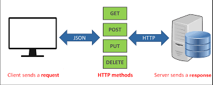

# RESTFul API



1.	__Khái niệm__

	- API ( Application Program Interface) có thể hiểu là phương thức dùng để giao tiếp giữa Serve và Client.
	- ```
	  An API for a website is code that allows two software programs to communicate with each another.
	  ```
	- REST ( Representation State Transfer) là một kiểu kiến trúc để viết API.
	- RESTful API là API được viết theo kiến trúc REST, sử dụng các HTTP Request để lấy, thêm, cập nhật, xóa dữ liệu.
2.	__RESTful API hoạt động như thế nào ?__
	
	- Các thao tác khác nhau trên Serve sẽ tương ứng với phương thức HTTP riêng của nó :
		- GET: Lấy dữ liệu ( ở dạng JSON, XML, ...).
		- POST: Tạo dữ liệu mới.
		- PUT: Thay đổi trạng thái hoặc cập nhật dữ liệu.
		- DELETE: Xóa dữ liệu.

	- GET và POST: 
		- GET không có body, tất cả param đều hiển thị trên url => tính bảo mật kém
		- POST giấu param trong body và mã hóa chúng => tính bảo mật cao hơn, tuy nhiên đối với Serve thì các method như Post, Put, Delete bị xem là nguy hiểm và cần có các cơ chế xác thực.
	

	- PUT và POST:
		- PUT bắt buộc phải truyền lên id của tài nguyên cần được cập nhật. Nếu tài nguyên đã tồn tại, nó sẽ thay thế tài nguyên đó. Ngược lại thì quá trình tạo mới sẽ diễn ra => Put thích hợp cho việc cập nhật dữ liệu do nó đảm bảo tính vẹn toàn dữ liệu. Nhất là trong trường hợp mạng bị chậm, khả năng việc submit 1 lần nhiều dữ liệu là rất cao.
		- POST không yêu cầu phải truyền lên id của tài nguyên, nên nó thích hợp cho việc tạo mới dữ liệu. Vì thông thường các hệ thống muốn giữ việc kiểm soát id, tự sinh ra id mới đối với các tài nguyên mới, hơn là giao cho client chỉ định id.

	- PUT và PATCH:
		- PUT cập nhật toàn bộ tài nguyên
		- PATCH chỉ cập nhật 1 phần tài nguyên được chỉ định ( ví dụ chỉ cần thay đổi field First Name).	

3. _Kết luận.		
	Trên thực tế, ta vẫn có thể viết API Get để tạo mới dữ liệu hay POST để lấy dữ liệu. Nhưng điều này là hoàn toàn không nên. Việc tuân thủ kiến trúc REST sẽ giúp chúng ta dễ dàng quản lý hệ thống API, tạo ra các API dễ hiểu, dễ sử dụng, dễ bảo trì, ...
