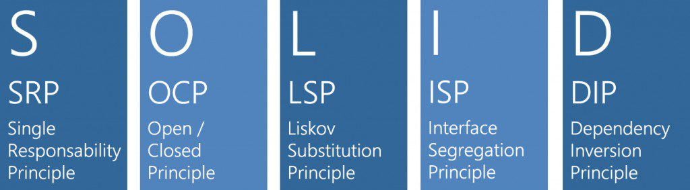

# Các nguyên lý SOLID trong OOP



SOLID là viết tắt các các nguyên lý:
- Single responsibility
- Open/ closed
- Liskov substitution
- Interface segregation
- Dependency inversion
Đây là các nguyên lý được đúc kết bởi kinh nghiệm của vô số developer, qua hàng ngàn dự án thành công và thất bại. Nắm vững và áp dụng những nguyên lý này sẽ giúp cho code dễ đọc, dễ scale, dễ bảo trì, dễ test hơn.

1. __Single responsibility Principle__
	- Nội dung nguyên lý: 
		```
		Một class chỉ nên giữ 1 trách nhiệm duy nhất.
		```
	Tuân thủ nguyên lý này sẽ giúp cho việc bảo trì code ( do thay đổi về yêu cầu chẳng hạn), test sẽ tốt hơn.

2.	__Open/ Closed Principle__
	- Nội dung nguyên lý:
		```
		Có thể thoải mái mở rộng 1 class, nhưng không được (hạn chế) sửa đổi bên trong class đó.( Open for extension but closed for modification).
		```
	Khi làm chức năng mới, ta nên viết class mới mở rộng class cũ ( bằng kế thừa hoặc sở hữu class cũ) chứ không nên chỉnh sửa class cũ. Điều này sẽ đảm bảo cho việc mở rộng chức năng chương trình không ảnh hưởng đến các chức năng đã viết trước đó.

3.	__Liskov Substitution Principle__
	- Nội dung nguyên lý:
	```
	Trong 1 chương trình, các object của class con có thể thay thế class cha mà không thay đổi tính đúng đắn của chương trình.
	```
	Điều này có nghĩa rằng, các class kế thừa từ 1 class cha phải đảm bảo thực hiện được các chức năng của class cha.
	Ví dụ: Class PinConHeo kế thừa class Pin. Trong trường hợp sử dụng PinConHeo thay cho Pin ở MayChoiGame. MayChoiGame phải đảm bảo hoạt động bình thường.
	Ví dụ khác: Trong C#, các class List, ArrayList, LinkedList cùng kế thừa interface IEnumerable => đều có thể chạy hàm foreach được.
	Một số ví dụ về việc vi phạm LSP:
		- Class con throw exception khi gọi hàm đã được overide lại hàm virtual của Class cha
		- Class con thay đổi hành vi Class cha.


4.	 __Interface Segregation Principle__
	- Nội dung nguyên lý:
	```
	Thay vì dùng 1 interface lớn, ta nên tách biệt thành nhiều interface nhỏ, với các mục đích cụ thể.
	```	
	Điều này sẽ giúp cho việc implement một interface trở nên dễ dàng hơn. Tưởng tượng 1 interface có 100 method và mỗi khi implement bằng 1 class ta phải triển khai cho 100 method đó, trong khi mục đích của ta là chỉ sử dụng một vài method.

5.	__Dependency Inversion Principle__
	- Nội dung nguyên lý:
	```
	Các module cấp cao không nên phụ thuộc vào các module cấp thấp. Cả hai nên phụ thuộc vào một trung gian là abstraction ( interface).
	Interface không nên phụ thuộc vào implemention, mà ngược lại ( Các class giao tiếp với nhau thông qua interface, không phải thông qua implemention)
	```
	- Điều này sẽ giảm sự ràng buộc giữa các module. Giúp cho việc bảo trì dễ dàng hơn khi có sự thay đổi yêu cầu về các module.
	- Ví dụ: Khi cần gửi mail, ta gọi phương thức sendMail() của interface Mailer. Sau này nếu có sự thay đổi về service gửi mail ( Ví dụ không dùng Mailgun nữa mà dùng Amazon Email Service), ta chỉ cần thay đổi Implemention của của interface Mailer. Thay vì sửa lại tất cả phương thức sendMail() trong code.  
	- Đây là nguyên lý cực kì quan trọng, là tiền đề cho Dependency Injection và Inversion of Control.
	- Nếu như Dependency Inversion là 1 nguyên lý, thì Inversion of Control là 1 design patern để tuân thủ nguyên lý đó, còn Dependency Injection là 1 cách để hiện thực Inversion of Control.
	Có 3 dạng Dependency Injection:
		- Constructor Injection ( phổ biến nhất)
		- Setter Injection
		- Interface Injection  
	Nội dụng cụ thể về Dependency Injection sẽ được trình bày và áp dụng cụ thể hơn ở "Laravel Architecture concepts."

6.	__Kết luận__
	Về bản chất, nguyên lý chỉ là nguyên lý, nó là hướng dẫn chứ không phải là quy tắc tuyệt đối. Trên thực tế vẫn còn rất nhiều tranh cãi của các Developer về các vấn đề này. Khi áp dụng các nguyên lý, hãy cân nhắc về độ lớn của dự án, độ lớn của module nữa. Việc áp dụng tốt và thích hợp các nguyên lý này sẽ giúp ta viết code dễ đọc, dễ quản lý, dễ mở rộng.

# References
- Sách Code dạo kí sự ( Phạm Huy Hoàng).
- https://itnext.io/solid-principles-explanation-and-examples-715b975dcad4 

	


